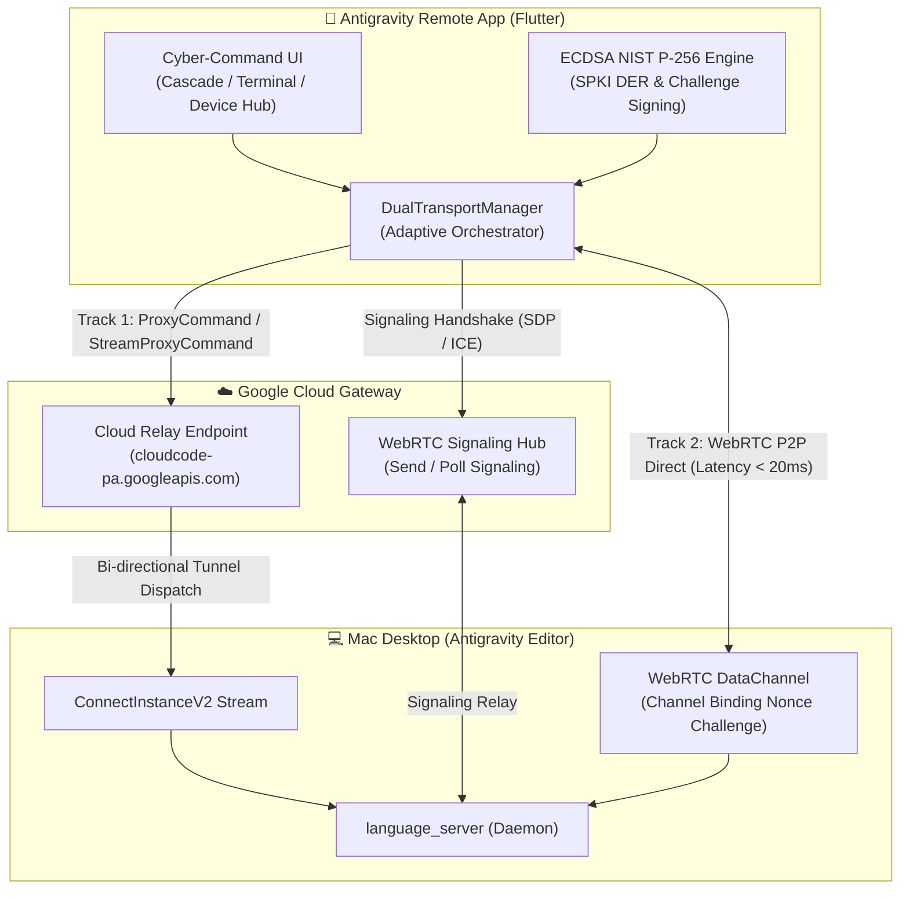
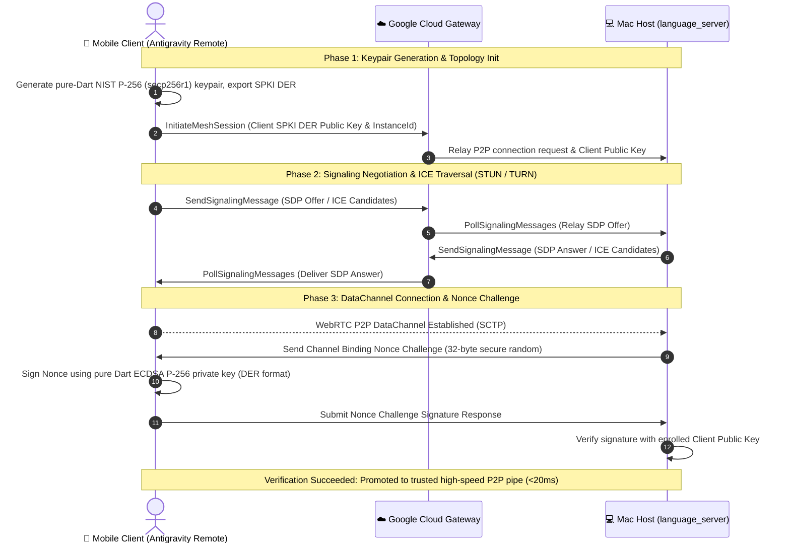

<div align="center">


# Antigravity Remote (遠端控制中樞)

**Next-Gen Cross-Platform Native Remote Deck for Antigravity (Google Jetski) Editor**  
*次世代 Antigravity (Google Jetski) 編輯器跨平台原生遠端控制工作台*

[](https://flutter.dev)
[](https://dart.dev)
[](https://riverpod.dev)
[](https://webrtc.org)
[](https://csrc.nist.gov)
[](LICENSE)

[繁體中文](#-繁體中文說明) • [English](#-english-documentation) • [架構 (Architecture)](#-核心架構亮點) • [截圖 (Screenshots)](#-介面截圖預覽) • [快速開始 (Quick Start)](#-快速開始-getting-started)

---

</div>

<a name="-繁體中文說明"></a>
## 🇹🇼 繁體中文說明

**Antigravity Remote** 是一款專為 **Antigravity (Google Jetski)** 打造的現代化跨平台原生控制客戶端（支援 iOS、Android 與 macOS）。透過深度逆向工程解析 Antigravity 本機二進位執行檔（`language_server`）、Protobuf 通訊協議（`devtools_jetski_boq_api_proto.ApiService` 與 `LanguageServerService`）、ConnectRPC 及 WebRTC P2P DataChannel，實現隨時隨地遠端調度、監控思考過程與審批本機終端指令。

---

### 🌟 核心架構亮點 (Architecture Highlights)

#### 1. 系統架構拓撲 (System Architecture Topology)

> 💡 **雙模式架構保證**：提供直觀純文字架構拓撲圖（保證在所有裝置與終端 100% 渲染）與動態 Mermaid 圖表雙重呈現。

```text
  ┌────────────────────────────────────────────────────────────────────────┐
  │                   📱 Antigravity Remote App (Flutter)                  │
  │  ┌─────────────────────────┐          ┌─────────────────────────────┐  │
  │  │    Cyber-Command UI     │          │    ECDSA NIST P-256 Engine  │  │
  │  │  (Cascade/Terminal/Hub) │          │     (DER/SPKI Key Storage)  │  │
  │  └────────────┬────────────┘          └──────────────┬──────────────┘  │
  │               │                                      │                 │
  │               ▼                                      ▼                 │
  │  ┌──────────────────────────────────────────────────────────────────┐  │
  │  │            DualTransportManager (自適應雙軌混合調度器)             │  │
  │  └────────────────┬──────────────────────────────────┬──────────────┘  │
  └───────────────────┼──────────────────────────────────┼─────────────────┘
                      │                                  │
         軌道 1 (Cloud Relay 模式)           軌道 2 (WebRTC P2P DataChannel)
         100% 穿透保底 / 無須公網 IP          極致低延遲 (<20ms) 直連通道
                      │                                  │
                      ▼                                  │
  ┌───────────────────────────────────────────────┐      │
  │           ☁️ Google Cloud Gateway             │      │
  │  ┌─────────────────────────────────────────┐  │      │
  │  │   cloudcode-pa.googleapis.com           │  │      │
  │  │   • ProxyCommand (Unary RPC)            │  │      │
  │  │   • StreamProxyCommand (Server Stream)  │  │      │
  │  │   • WebRTC Signaling Hub (SDP/ICE)      │  │      │
  │  └────────────────────┬────────────────────┘  │      │
  └───────────────────────┼───────────────────────┘      │
                          │                              │
                          │ 雙向出站長串流轉發           │ 5-Byte Framing
                          │ (ConnectInstanceV2 Stream)   │ SCTP 直連通道
                          ▼                              ▼
  ┌────────────────────────────────────────────────────────────────────────┐
  │              💻 Mac Desktop / Host (Antigravity Editor)                │
  │  ┌───────────────────────────────┐     ┌────────────────────────────┐  │
  │  │   ConnectInstanceV2 Client    │     │    WebRTC DataChannel      │  │
  │  │      (Outbound Tunnel)        │     │  (Channel Binding Nonce)   │  │
  │  └───────────────┬───────────────┘     └─────────────┬──────────────┘  │
  │                  │                                   │                 │
  │                  └─────────────────┬─────────────────┘                 │
  │                                    ▼                                   │
  │  ┌──────────────────────────────────────────────────────────────────┐  │
  │  │          LanguageServer Daemon (本機 ConnectRPC 服務)             │  │
  │  │  • devtools_jetski_boq_api_proto.ApiService                      │  │
  │  │  • devtools_jetski_boq_api_proto.LanguageServerService           │  │
  │  └──────────────────────────────────────────────────────────────────┘  │
  └────────────────────────────────────────────────────────────────────────┘
```


#### 2. 雙軌混合自適應傳輸 (Dual-Transport Hybrid Architecture)

| 特性指標 | 軌道 1：Cloud Relay (雲端中繼模式) | 軌道 2：WebRTC P2P DataChannel (直連網格模式) |
| :--- | :--- | :--- |
| **端到端延遲** | 80ms ~ 150ms | **&lt; 20ms (極致低延遲)** |
| **網路穿透率** | **100% 絕對穿透** (任何 NAT / 公司企業防火牆) | 依賴 STUN/TURN ICE 候選穿透 |
| **桌面端需求** | **無須公網 IP、無須 Port Forwarding、無須 DDNS** | 桌面端與行動端完成 WebRTC 握手與 Nonce 認證 |
| **通訊協議** | HTTP/2 ConnectRPC (`ProxyCommand` / `StreamProxyCommand`) | SCTP / WebRTC DataChannel (自訂 5-byte 分幀) |
| **安全握手** | Google Cloud OAuth / Bearer Token 鑑權 | 純 Dart NIST P-256 ECDSA 挑戰簽名校驗 |
| **適用場景** | 初次配對、4G/5G 移動切網、複雜企業內網環境 | 即時思考串流監控、即時終端輸出、虛擬鍵盤敲擊 |

- **軌道 1 (Cloud Relay 模式，100% 可靠性保底)**：
  - 客戶端直接向 Google Cloud 閘道器發起 `ProxyCommand`（Unary 請求）與 `StreamProxyCommand`（Server Streaming 串流）。
  - 桌面端（Mac）啟動時對雲端主動維護一條出站（Outbound）長串流 `ConnectInstanceV2`，雲端直接沿該通道將客戶端 RPC 雙向轉發給本機 `language_server`。
  - **使用者完全不需要設定路由器連接埠映射 (NAT Port Forwarding)、公網固定 IP 或動態網域名稱 (DDNS)**。
- **軌道 2 (WebRTC P2P DataChannel 模式，極致低延遲)**：
  - 客戶端調用 `InitiateMeshSession`，並上報客戶端本地生成的 **NIST P-256 (secp256r1) ECDSA 公鑰**（DER / SPKI 格式）。
  - 透過 Google STUN 伺服器 (`stun:stun.l.google.com:19302`) 與 TURN 伺服器進行 ICE 候選交換，透過 `SendSignalingMessage` 與 `PollSignalingMessages` 完成 SDP Offer/Answer 信令協商。
  - WebRTC DataChannel 連通後，桌面端發送 **32-byte 隨機數 Nonce 挑戰 (Channel Binding Challenge)**。
  - 客戶端以純 Dart ECDSA P-256 私鑰完成挑戰簽章並回傳，桌面端驗簽成功後即刻升級為最高優先級直連通道，端到端延遲降至 **< 20ms**！
- **智慧自適應降級與切換 (Smart Multiplexer)**：
  - 當 WebRTC 直連中斷或弱網抖動時，`DualTransportManager` 在毫秒級內無縫平滑回退至 Cloud Relay 軌道，確保操控指令不遺失、不中斷。

#### 3. 5 位元組資料分幀標準 (DataChannel Framing Specification)

WebRTC DataChannel 傳輸遵循二進位 5 位元組分幀標頭標準，確保封包完整性與高效流式解析：

```text
 0                   1                   2                   3
 0 1 2 3 4 5 6 7 8 9 0 1 2 3 4 5 6 7 8 9 0 1 2 3 4 5 6 7 8 9 0 1
+-+-+-+-+-+-+-+-+-+-+-+-+-+-+-+-+-+-+-+-+-+-+-+-+-+-+-+-+-+-+-+-+
| Compress Flag |               Payload Length (uint32)         |
|   (1 Byte)    |                 [Bytes 1 to 4]                |
+-+-+-+-+-+-+-+-+-+-+-+-+-+-+-+-+-+-+-+-+-+-+-+-+-+-+-+-+-+-+-+-+
|                        Payload Data                           |
|                    [Length Bytes: 5 .. N]                     |
+-+-+-+-+-+-+-+-+-+-+-+-+-+-+-+-+-+-+-+-+-+-+-+-+-+-+-+-+-+-+-+-+
```

| 位移 (Byte Offset) | 欄位名稱 | 型別 | 定義與說明 |
| :--- | :--- | :--- | :--- |
| `Byte 0` | **Compression Flag** | `uint8` | 壓縮標記。`0x00` 表示無壓縮（Raw），`0x01` 表示 Gzip 壓縮。 |
| `Bytes 1 - 4` | **Payload Length** | `uint32` (Big-Endian) | 負載資料長度（大端序 32 位元整數）。 |
| `Bytes 5 .. N` | **Payload Data** | `uint8[]` | 實際承載的 ConnectRPC Protobuf 封包或終端字元流資料。 |

#### 4. NIST P-256 ECDSA 雙向握手挑戰 (Security Handshake Sequence)

為防止中間人攻擊 (MITM) 與未授權頻道劫持，Antigravity Remote 在 P2P 建立後執行強制雙向加密驗證：


---

<a name="-介面截圖預覽"></a>
### 📱 介面截圖預覽 (UI Screenshots & Deck Previews)

> 📸 **實機截圖驗證**：以下畫面均來自 Android 模擬器（Android 15 API 35）真實運行截圖，絕非 AI 概念圖或生成圖片。

為提供無與倫比的遠端操縱手感，Antigravity Remote 採用 Cyber-Command 深空暗色主題，整合三大核心控制模組：

<div align="center">
  <table>
    <tr>
      <td align="center" width="33%">
        <b>🧠 Cascade 思考串流與指令審批</b><br/>
        <sub>即時神經脈衝、思維耗時與危險指令審批</sub><br/><br/>
        
      </td>
      <td align="center" width="33%">
        <b>💻 遠端即時終端控制台</b><br/>
        <sub>串流終端日誌、虛擬快捷晶片鍵盤</sub><br/><br/>
        
      </td>
      <td align="center" width="33%">
        <b>📡 裝置中樞與雙軌狀態</b><br/>
        <sub>NIST P-256 指紋、延遲儀表與 QR 掃描</sub><br/><br/>
        
      </td>
    </tr>
  </table>
</div>

---

### ✨ 主要功能特色

| 功能模組 | 特色描述 |
| :--- | :--- |
| 📸 **一鍵 QR 掃碼配對** | 整合 `mobile_scanner`，支援解析 Antigravity 官方生成的 Google AccountChooser 格式、`antigravity://` 深度連結、JSON 與直接 UUID 輸入。 |
| 🧠 **Cascade 思考即時串流** | 擬真神經網絡脈衝動畫，即時呈現 Agent 內部思維推理過程 (`ThinkingCard`)，可自由展開/折疊並顯示精準耗時。 |
| 🛠️ **Trajectory 工具執行步驟** | 視覺化呈現 `run_command`、`replace_file_content`、`write_to_file`、`read_file` 等工具調用，內建語法著色之代碼變更對照 (`CodeDiffViewer`)。 |
| 🛡️ **指令安全審批互動** | 當 Agent 進入 `WAITING_USER_INTERACTION` 狀態時，自動彈出審批對話框，針對高危險指令（如 `rm`、`sudo`）提供醒目標籤，支援一鍵 Approve / Reject 及回傳補充反饋。 |
| 💻 **即時遠端終端控制台** | 串流監看本機終端輸出 (`StreamTerminalOutput`)，提供專用虛擬快捷晶片鍵盤（`Ctrl+C`、`Enter`、`Tab`、`clear`）與輸入調度 (`SendTerminalInput`)。 |
| 🧪 **完整離線演示模式 (Demo Mode)** | 內建高保真度模擬器 (`MockAntigravityService`)，在未連接真實 Mac 桌面端時亦能即時體驗完整思考、審批、終端日誌與雙軌切換。 |

---

### 🎨 UI/UX 設計理念 (Cyber-Command Deck)

- **配色體系**：深空石墨曜石黑 (`#080C14` / `#0F172A`) 底色，搭配高對比雷射青 (`#00E5FF`)、翡翠綠 (`#00E676`)、警示琥珀 (`#FFB300`)、霓虹洋紅 (`#FF3366`) 與神經紫羅蘭 (`#A855F7`)。
- **字型排版**：採用 Google Fonts 的 **JetBrains Mono**（代碼、UUID、終端輸出）與 **Plus Jakarta Sans / Outfit**（標題與介面層級）。
- **微互動質感**：雙軌連線狀態指示燈 (`StatusIndicator`)、即時 Ping 延遲計量儀 (`TransportBadge`)、雷射掃描動畫視窗與磨砂玻璃質感卡片。
- **全平台自適應**：
  - 手機端：單手好操作的底部 Cyber 導航列。
  - 平板 / macOS 桌面端：左側 NavigationRail + Split Panel 主從工作流排版。

---

<a name="-english-documentation"></a>
## 🌐 English Documentation

**Antigravity Remote** is an ultra-modern, cross-platform native remote control companion (supporting iOS, Android, and macOS) built specifically for the **Antigravity (Google Jetski)** editor.

Reverse-engineered from the Antigravity local binary daemon (`language_server`), Protobuf schemas (`devtools_jetski_boq_api_proto.ApiService` & `LanguageServerService`), ConnectRPC, and WebRTC P2P DataChannel protocols, it allows developers to remotely supervise, review thought streams, and approve terminal commands on their host Mac from anywhere.

---

### 🚀 Key Architectural Pillars

#### 1. System Architecture Topology

> 💡 **Dual Visual Presentation**: Provides a guaranteed ASCII/Unicode architecture topology (100% rendered across all markdown viewports, mobile apps, and CLI terminals) alongside a dynamic Mermaid flowchart.

```text
  ┌────────────────────────────────────────────────────────────────────────┐
  │                   📱 Antigravity Remote App (Flutter)                  │
  │  ┌─────────────────────────┐          ┌─────────────────────────────┐  │
  │  │    Cyber-Command UI     │          │    ECDSA NIST P-256 Engine  │  │
  │  │  (Cascade/Terminal/Hub) │          │     (DER/SPKI Key Storage)  │  │
  │  └────────────┬────────────┘          └──────────────┬──────────────┘  │
  │               │                                      │                 │
  │               ▼                                      ▼                 │
  │  ┌──────────────────────────────────────────────────────────────────┐  │
  │  │            DualTransportManager (Adaptive Orchestrator)          │  │
  │  └────────────────┬──────────────────────────────────┬──────────────┘  │
  └───────────────────┼──────────────────────────────────┼─────────────────┘
                      │                                  │
          Track 1: Cloud Relay Mode           Track 2: WebRTC P2P DataChannel
          100% Reliable NAT Traversal         Ultra-Low Latency (<20ms Direct)
                      │                                  │
                      ▼                                  │
  ┌───────────────────────────────────────────────┐      │
  │           ☁️ Google Cloud Gateway             │      │
  │  ┌─────────────────────────────────────────┐  │      │
  │  │   cloudcode-pa.googleapis.com           │  │      │
  │  │   • ProxyCommand (Unary RPC)            │  │      │
  │  │   • StreamProxyCommand (Server Stream)  │  │      │
  │  │   • WebRTC Signaling Hub (SDP/ICE)      │  │      │
  │  └────────────────────┬────────────────────┘  │      │
  └───────────────────────┼───────────────────────┘      │
                          │                              │
                          │ Bi-directional Stream Relay  │ 5-Byte Framing
                          │ (ConnectInstanceV2 Stream)   │ SCTP DataChannel
                          ▼                              ▼
  ┌────────────────────────────────────────────────────────────────────────┐
  │              💻 Mac Desktop / Host (Antigravity Editor)                │
  │  ┌───────────────────────────────┐     ┌────────────────────────────┐  │
  │  │   ConnectInstanceV2 Client    │     │    WebRTC DataChannel      │  │
  │  │      (Outbound Tunnel)        │     │  (Channel Binding Nonce)   │  │
  │  └───────────────┬───────────────┘     └─────────────┬──────────────┘  │
  │                  │                                   │                 │
  │                  └─────────────────┬─────────────────┘                 │
  │                                    ▼                                   │
  │  ┌──────────────────────────────────────────────────────────────────┐  │
  │  │          LanguageServer Daemon (Local ConnectRPC Service)         │  │
  │  │  • devtools_jetski_boq_api_proto.ApiService                      │  │
  │  │  • devtools_jetski_boq_api_proto.LanguageServerService           │  │
  │  └──────────────────────────────────────────────────────────────────┘  │
  └────────────────────────────────────────────────────────────────────────┘
```



#### 2. Dual-Transport Hybrid Architecture Comparison

| Metric / Dimension | Track 1: Cloud Relay Mode | Track 2: WebRTC P2P DataChannel Mesh |
| :--- | :--- | :--- |
| **End-to-End Latency** | 80ms ~ 150ms | **&lt; 20ms (Ultra-Low Latency)** |
| **NAT / Firewall Traversal** | **100% Guaranteed** (Outbound HTTP/2) | STUN/TURN ICE candidate negotiation |
| **Host Configuration** | **Zero Config (No public IP, port forwarding, or DDNS)** | Authenticated peer handshake |
| **Protocol Stack** | HTTP/2 ConnectRPC (`ProxyCommand` / `StreamProxyCommand`) | SCTP / WebRTC DataChannel (5-byte framing) |
| **Security Layer** | Google Cloud OAuth / Bearer Token | Pure-Dart ECDSA NIST P-256 Nonce Signing |
| **Primary Use Cases** | Initial pairing, cellular networks, complex corporate VPNs | Reactive thought streaming, live terminal, keystrokes |

- **Track 1: Cloud Relay Mode (100% Reliable Fallback)**:
  - Client connects to Google Cloud Gateway (`cloudcode-pa.googleapis.com`) using `ProxyCommand` (Unary) and `StreamProxyCommand` (Server Streaming).
  - Google Cloud dispatches RPCs through an outbound persistent bi-directional streaming pipe (`ConnectInstanceV2`) maintained by the host Mac.
  - **No public IP, router port forwarding, or dynamic DNS required on the developer's Mac**.
- **Track 2: WebRTC P2P DataChannel Mesh Mode (<20ms Ultra-Low Latency)**:
  - Client calls `InitiateMeshSession` and submits a client-generated **NIST P-256 (secp256r1) ECDSA Public Key** in DER/SPKI format.
  - Cloud provides STUN (`stun:stun.l.google.com:19302`) and TURN configuration for ICE candidate discovery.
  - Signaling messages (SDP Offer/Answer & ICE Candidates) are exchanged via `SendSignalingMessage` and `PollSignalingMessages`.
  - Once the DataChannel connects, the host Mac sends a **Channel Binding Nonce Challenge** (32-byte cryptographic random nonce).
  - The client signs the nonce using pure Dart ECDSA P-256 cryptography and returns the signature; upon verification, the session is promoted to a high-speed direct peer pipe with **latency < 20ms**!
- **Adaptive Multiplexing**:
  - `DualTransportManager` continuously monitors round-trip latency and connection health, seamlessly falling back to Cloud Relay if P2P degrades, ensuring zero dropped commands.

#### 3. 5-Byte Data Framing Format

```text
 0                   1                   2                   3
 0 1 2 3 4 5 6 7 8 9 0 1 2 3 4 5 6 7 8 9 0 1 2 3 4 5 6 7 8 9 0 1
+-+-+-+-+-+-+-+-+-+-+-+-+-+-+-+-+-+-+-+-+-+-+-+-+-+-+-+-+-+-+-+-+
| Compress Flag |               Payload Length (uint32)         |
|   (1 Byte)    |                 [Bytes 1 to 4]                |
+-+-+-+-+-+-+-+-+-+-+-+-+-+-+-+-+-+-+-+-+-+-+-+-+-+-+-+-+-+-+-+-+
|                        Payload Data                           |
|                    [Length Bytes: 5 .. N]                     |
+-+-+-+-+-+-+-+-+-+-+-+-+-+-+-+-+-+-+-+-+-+-+-+-+-+-+-+-+-+-+-+-+
```

| Byte Offset | Field Name | Type | Description |
| :--- | :--- | :--- | :--- |
| `Byte 0` | **Compression Flag** | `uint8` | `0x00` = Raw Uncompressed, `0x01` = Gzip Compressed. |
| `Bytes 1 - 4` | **Payload Length** | `uint32` (Big-Endian) | Length of following payload in big-endian byte order. |
| `Bytes 5 .. N` | **Payload Data** | `uint8[]` | ConnectRPC Protobuf envelope bytes or streaming terminal chunks. |

#### 4. NIST P-256 ECDSA Security Handshake Sequence



#### 2. Feature Matrix
- 📸 **Instant QR Code Pairing**: Supports Google AccountChooser URLs, deep links (`antigravity://`), configuration JSON, and raw instance UUIDs.
- 🧠 **Cascade Reactive Thought Streaming**: Neural pulse animation displaying agent reasoning in real-time (`ThinkingCard`) with precise duration timing.
- 🛠️ **Trajectory Step Cards & Diff Viewer**: Live status of tool executions (`run_command`, `replace_file_content`, etc.) and syntax-highlighted code diffs.
- 🛡️ **Interactive Safety Approvals**: Action sheet prompts when an agent requires authorization (`WAITING_USER_INTERACTION`) with security flags for destructive commands.
- 💻 **Live Remote Terminal**: Continuous terminal output streaming with specialized virtual keys (`Ctrl+C`, `Enter`, `Tab`, `clear`) and input transmission.
- 🧪 **Built-in Offline Demo Mode**: High-fidelity simulator (`MockAntigravityService`) enabling comprehensive hands-on evaluation without an active desktop connection.

#### 3. Deck Previews & UI Screenshots

> 📸 **Live Emulator Verification**: All deck screenshots below are captured directly from authentic Android Emulator sessions (Android 15 API 35) running the native Flutter app.

<div align="center">
  <table>
    <tr>
      <td align="center" width="33%">
        <b>🧠 Cascade Stream & Approval</b><br/>
        <sub>Live neural pulses, thought duration & security modals</sub><br/><br/>
        
      </td>
      <td align="center" width="33%">
        <b>💻 Live Remote Terminal</b><br/>
        <sub>Live terminal logs, cyber virtual keypad</sub><br/><br/>
        
      </td>
      <td align="center" width="33%">
        <b>📡 Device Hub & Telemetry</b><br/>
        <sub>NIST P-256 fingerprint, latency gauge & QR pairing</sub><br/><br/>
        
      </td>
    </tr>
  </table>
</div>

---

## 📂 專案目錄結構 (Project Structure)

```text
antigravity_remote/
├── assets/
│   └── images/
│       ├── banner.png                      # Cyber-command repository banner
│       ├── cascade_deck.png                # Cascade thought & approval preview
│       ├── device_hub.png                  # Device pairing & telemetry preview
│       └── terminal_deck.png               # Live terminal console preview
├── docs/
│   ├── banner.png                          # Documentation preview banner
│   └── screenshots/                        # Deck screenshot previews
│       ├── cascade_deck.png
│       ├── device_hub.png
│       └── terminal_deck.png
├── lib/
│   ├── main.dart                           # Application entry point & Riverpod root
│   ├── app.dart                            # Dark Cyber Theme & Adaptive Layout
│   ├── core/
│   │   ├── models/                         # Domain models (Cascade, Instance, Terminal, Trajectory)
│   │   ├── network/
│   │   │   ├── cloud_relay_client.dart     # Cloud Relay (ProxyCommand / StreamProxyCommand)
│   │   │   ├── dual_transport_manager.dart # Adaptive Dual-Transport orchestrator
│   │   │   ├── ecdsa_p256_service.dart     # Pure Dart NIST P-256 keygen, SPKI DER & Signing
│   │   │   ├── endpoints.dart              # Google Cloud RPC route definitions
│   │   │   ├── transport_interface.dart    # Abstract transport contracts & framing
│   │   │   └── webrtc_mesh_client.dart     # WebRTC DataChannel & DTLS challenge handshake
│   │   ├── services/
│   │   │   ├── mock_antigravity_service.dart # Offline demo mock generator
│   │   │   ├── qr_parser_service.dart      # QR Code & URL parameter parser
│   │   │   ├── remote_control_service.dart # Unified stream dispatcher & approval handler
│   │   │   └── storage_service.dart        # SharedPreferences persistence
│   │   └── theme/
│   │       └── app_theme.dart              # CyberColors, typography & UI styling
│   ├── features/
│   │   ├── cascade/                        # Cascade chat view, thinking cards & approval modals
│   │   ├── device/                         # Device hub, QR scanner & connection settings
│   │   └── terminal/                       # Live terminal stream & virtual keystroke console
│   └── shared/                             # Reusable cyber buttons, cards & indicators
└── test/
    ├── core/                               # Unit tests for network, crypto & parsers
    ├── features/                           # Riverpod state notifier unit tests
    └── widget_tests/                       # Widget integration & interaction tests
```

---

## ⚡ 快速開始 (Getting Started)

### 前置要求 (Prerequisites)
- [Flutter SDK](https://flutter.dev) `^3.38.0` (Dart `^3.10.0`)
- Xcode 16+ (適用於 iOS / macOS 構建)
- Android Studio / Android SDK (適用於 Android 構建)

### 安裝與啟動 (Installation & Run)

```bash
# 1. 克隆本儲存庫 (Clone repository)
git clone https://github.com/ImL1s/antigravity-remote.git
cd antigravity-remote

# 2. 獲取相依套件 (Get dependencies)
flutter pub get

# 3. 運行單元與 Widget 測試 (Run tests)
flutter test

# 4. 啟動應用 (Run application)
flutter run
```

---

## 📱 配對操作指南 (Pairing Guide)

1. 在 Mac 桌面端開啟 **Antigravity** 編輯器。
2. 開啟 **Settings** -> 搜尋 **Remote Control**。
3. 開啟 **Enable Remote Control** 切換開關。
4. 點選畫面顯示的 QR Code，或點擊複製連結。
5. 在手機或平板端開啟 **Antigravity Remote**，點選「掃描 QR 配對」或手動貼上連結。
6. 連線成功後，雙軌傳輸指示燈轉為綠色/青色，即可即時接管遠端 Agent 思考與終端控制！

---

## 🧪 測試驗證記錄 (Verification Record)

本專案經過嚴格的單元測試與 Widget 整合測試覆蓋：

```bash
flutter test
```

- ✅ **ECDSA NIST P-256 密鑰與簽名測試**：驗證公私鑰生成、SPKI DER 編碼導出及 Channel Binding Nonce 簽章驗證。
- ✅ **QR Parser 測試**：驗證 Google AccountChooser、`antigravity://` 深度連結、JSON 負載與直接 UUID 解析。
- ✅ **RemoteControlService 測試**：驗證 Live 模式與 Demo 模式切換、即時思考串流、軌跡步驟解析及審批指令派送。
- ✅ **Riverpod Notifier 測試**：覆蓋 `CascadeNotifier`、`TerminalNotifier`、`DeviceNotifier` 的狀態變遷與生命週期。
- ✅ **Widget 測試**：驗證 `TransportBadge` 徽章渲染、`ThinkingCard` 展開折疊、`TrajectoryStepCard` 行內審批按鈕及標籤導航切換。

---

## 📄 開源授權 (License)

This project is licensed under the MIT License - see the [LICENSE](LICENSE) file for details.
