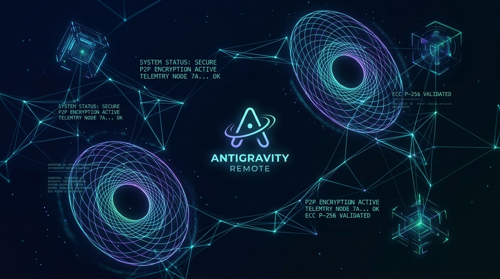
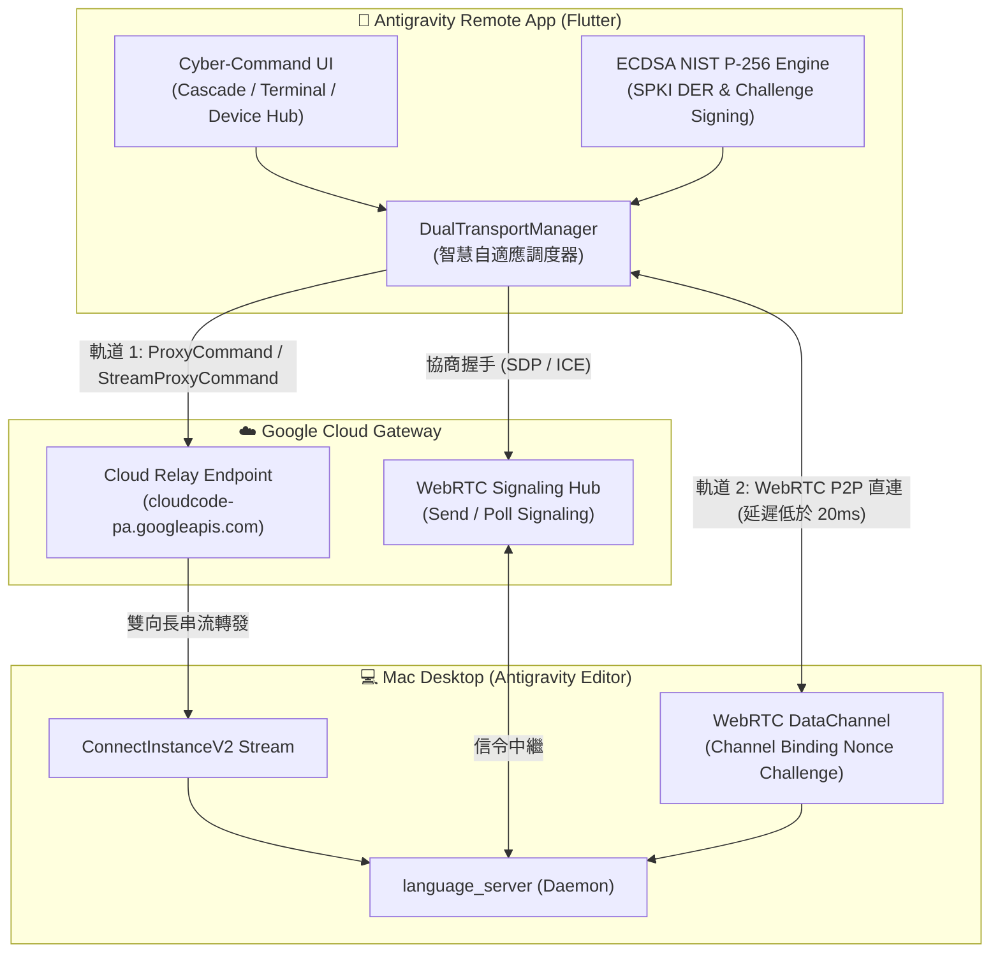
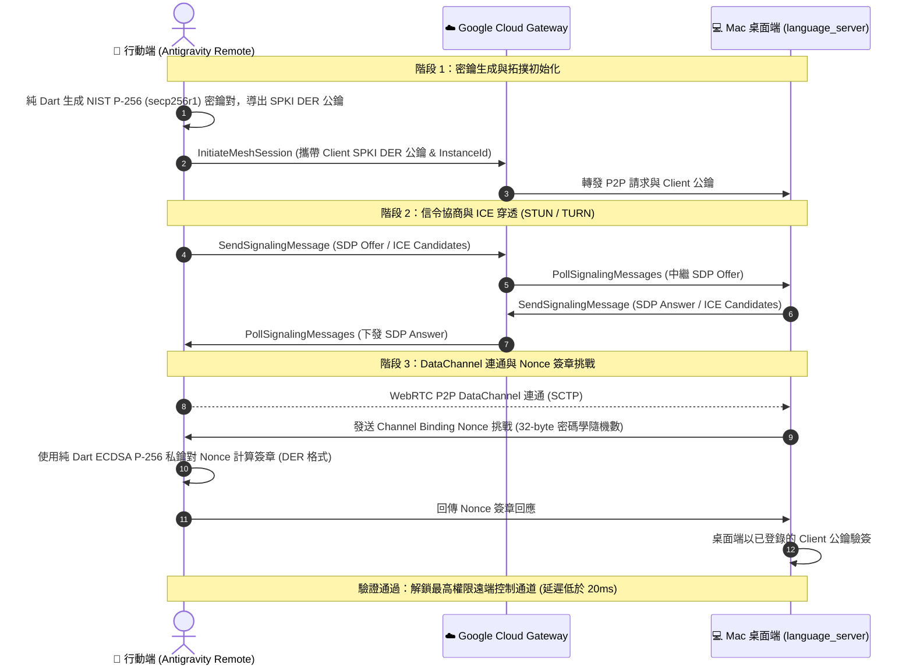
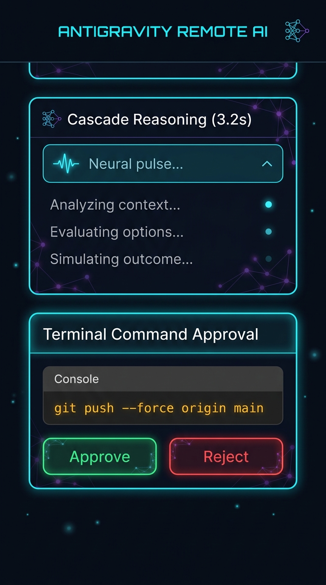
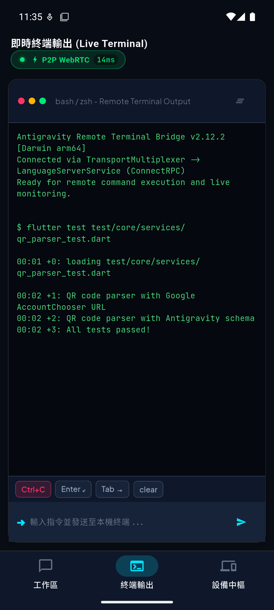
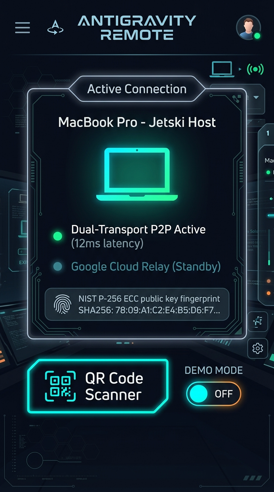
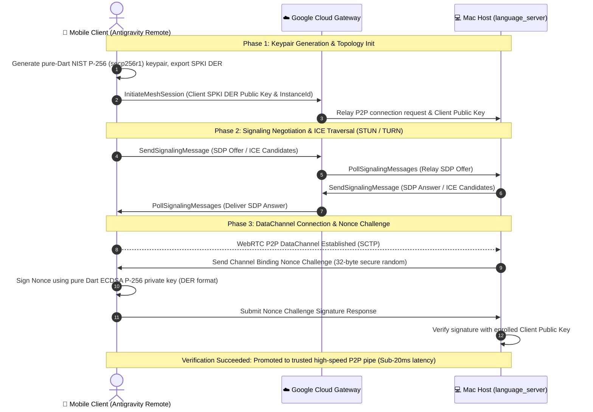

<div align="center">



# Antigravity Remote (遠端控制中樞)

**Development, Issues & Pull Requests:**  
https://github.com/aa22396584/antigravity-remote

**Mirrors:**  
[GitLab](https://gitlab.com/aa22396584/antigravity-remote) ·
[Codeberg](https://codeberg.org/ImL1s/antigravity-remote)


> **Why this GitHub home?** Public development moved here from [`ImL1s/antigravity-remote`](https://github.com/ImL1s/antigravity-remote) because that GitHub account is currently restricted (anonymous visitors get 404 on the profile and many assets). This is the same project. Please open Issues and Pull Requests here.

**Next-Gen Cross-Platform Native Remote Deck for Antigravity (Google Jetski) Editor**  
*次世代 Antigravity (Google Jetski) 編輯器跨平台原生遠端控制工作台*

[](https://flutter.dev)
[](https://dart.dev)
[](https://riverpod.dev)
[](https://webrtc.org)
[](https://csrc.nist.gov)
[](https://github.com/aa22396584/antigravity-remote/releases/tag/v1.1.0)
[](https://github.com/aa22396584/antigravity-remote/actions)
[](https://github.com/aa22396584/antigravity-remote/issues/34)
[](LICENSE)

[繁體中文](#-繁體中文說明) • [English](#-english-documentation) • [📦 下載 Release](#-下載與安裝-download--releases) • [🛡️ 5 大 P0 防禦](#-5-大-p0-核心安全與控制可靠性防禦) • [📋 34 項稽核成果](#-2026-09-全面功能稽核成果) • [架構亮點](#-核心架構亮點) • [介面預覽](#-介面截圖預覽) • [快速開始](#-快速開始-getting-started)

---

</div>

<a name="-繁體中文說明"></a>
## 🇹🇼 繁體中文說明

> ⚠️ **第三方專案聲明 / Disclaimer**：本專案為社群第三方開源客戶端，非 Google 官方產品。所有連線與遠端控制依賴使用者自行授權之憑證。已完成 2026-09 全面功能與協議安全稽核。各平台支援度請參閱 [平台能力矩陣](docs/platform_matrix.md) 與 [協議相容性規格](docs/protocol/compatibility.md)。

**Antigravity Remote** 是一款專為 **Antigravity (Google Jetski)** 打造的現代化跨平台原生控制客戶端（支援 iOS、Android 與 macOS）。透過深度逆向工程解析 Antigravity 本機二進位執行檔（`language_server`）、Protobuf 通訊協議（`devtools_jetski_boq_api_proto.ApiService` 與 `LanguageServerService`）、ConnectRPC 及 WebRTC P2P DataChannel，實現隨時隨地遠端調度、監控思考過程與審批本機終端指令。

---

<a name="-下載與安裝-download--releases"></a>
### 📦 下載與安裝 (Download & Releases)

最新穩定正式版本：**v1.1.0** (Build `1.1.0+2`，發布日期：2026-09-06)

| 產物類型 | 下載 / 訪問連結 | 規格與校驗說明 |
| :--- | :--- | :--- |
| 🤖 **Android 生產級 APK** | [**antigravity-remote-v1.1.0.apk (112.8MB)**](https://github.com/aa22396584/antigravity-remote/releases/download/v1.1.0/antigravity-remote-v1.1.0.apk) / [app-release.apk](https://github.com/aa22396584/antigravity-remote/releases/download/v1.1.0/app-release.apk) | 支援 Android 7.0+ (API 24+)，通過 APK Signature Scheme v2 簽名驗證<br/>`SHA-256: 6bcf0eb7b44fabc7cc420b6a6ae61c71f5da32e332fbd7f776c07963c71c70fd` |
| 🚀 **GitHub Release 官方頁面** | [**GitHub Releases / v1.1.0**](https://github.com/aa22396584/antigravity-remote/releases/tag/v1.1.0) | 官方正式發布頁面、二進位產物與驗證簽名 |
| 📝 **結構化更新日誌** | [**CHANGELOG.md**](CHANGELOG.md) | 完整記錄本次 34 項 Issues 稽核成果與重大修復細節 |
| 🗺️ **平台相容與能力矩陣** | [**docs/platform_matrix.md**](docs/platform_matrix.md) | 各作業系統功能支援級別（Android / iOS / macOS / Desktop） |
| 📜 **協議相容性規格書** | [**docs/protocol/compatibility.md**](docs/protocol/compatibility.md) | 雙軌傳輸、5-byte 分幀規範與 RPC 端點定義 |

> 🔒 **APK 雜湊校驗指南 (SHA-256 Checksum)**：
> ```bash
> shasum -a 256 antigravity-remote-v1.1.0.apk
> # 預期輸出：6bcf0eb7b44fabc7cc420b6a6ae61c71f5da32e332fbd7f776c07963c71c70fd
> ```

---

<a name="-5-大-p0-核心安全與控制可靠性防禦"></a>
### 🛡️ 5 大 P0 核心安全與控制可靠性防禦 (P0 Security & Control Reliability)

針對遠端指令調度與 AI Agent 接管的核心安全隱患，本專案在 v1.1.0 完成了 5 大 P0 致命缺陷的徹底修復與防禦機制構建：

| P0 項次 | 核心威脅與架構缺陷 | 解決方案與防禦機制 | 驗證測試套件 |
| :--- | :--- | :--- | :--- |
| **P0 #1** | **切換／刪除裝置目標不一致**<br/>切換或刪除主機後，舊連線殘留輪詢，導致指令誤發給非目標主機 | **原子清理與目標一致性工廠**<br/>切換或刪除設備時強制中斷舊 Transport、撤銷輪詢 Epoch、重置 Cascade 工作區狀態與待審批佇列 | `device_target_consistency_test.dart` |
| **P0 #2** | **WebRTC DataChannel 盲配回覆與跨串流混流**<br/>過去採 FIFO 盲配回覆，網路抖動即錯位；串流未隔離 | **RequestID 關聯映射與實體頻道隔離**<br/>為所有 Unary RPC 分配遞增唯一的 RequestID；將控制認證 (`0x00`)、Cascade 思考串流 (`0x01`) 與終端輸出 (`0x02`) 實體隔離 | `p0_protocol_security_test.dart` |
| **P0 #3** | **非冪等在途寫入操作盲目重送**<br/>P2P 中斷切換至 Relay 時，若重送在途破壞性指令（如 `rm -rf`）會引發嚴重災難 | **非冪等在途寫入操作防護閘門**<br/>嚴格區分 `PreFlightException`（連線前失敗，允許回退重試）與 `InFlightRpcException`（在途無 ACK，禁止盲目重試） | `p0_protocol_security_test.dart` |
| **P0 #4** | **審批操作假樂觀完成與失敗狀態丟失**<br/>點擊審批後本地直接標記成功，若遠端失敗使用者無法感知且無法再次操作 | **遠端 200 OK 確認握手與狀態保留**<br/>審批請求改為非同步防抖並等待遠端確認；失敗時完整保留待審批狀態與步驟，允許重試並加入防連點互斥保護 | `cascade_p0_approval_test.dart` |
| **P0 #10** | **WebRTC P2P 握手 Fail-Open 安全漏洞**<br/>連通後未經 NIST P-256 Nonce 認證即宣告連線成功並流通業務封包 | **Fail-Closed 握手狀態機安全閘門**<br/>嚴格遵循 `unauthenticated` ➔ `challengePending` ➔ `authenticated` 狀態機，未獲合法 ACK 前全面阻絕業務封包與敏感指令 | `p0_protocol_security_test.dart` |

---

<a name="-2026-09-全面功能稽核成果"></a>
### 📋 2026-09 全面功能稽核成果 (34 項 Issues 規範)

本專案在 2026-09 完成了由社群與架構團隊發起的全面工程稽核（追蹤於 [Issue #34](https://github.com/aa22396584/antigravity-remote/issues/34)），涵蓋 33 項專業子任務與總體驗收體系：

- 🛡️ **核心控制與協議安全 (P0: 5 項)**：
  - [x] `#1` 切換／刪除裝置後控制目標一致性與原子清理
  - [x] `#2` WebRTC DataChannel RequestID 配對機制與多工串流隔離
  - [x] `#3` 禁止不確定結果的非冪等寫入 RPC 在 P2P→Relay 間自動重送
  - [x] `#4` 審批動作非同步等待遠端確認、失敗狀態完整保留與防連點保護
  - [x] `#10` WebRTC 握手 Fail-Closed 狀態機，驗證成功前阻絕所有業務封包
- 🌐 **連線、協議相容性與安全傳輸 (P1: 12 項)**：
  - [x] `#5` 對話上下文生命週期隔離、先訂閱後發送保證
  - [x] `#6` 移除假連線與固定 28ms 假延遲，Demo 與 Live 模式嚴格物理隔離
  - [x] `#7` 真實 Instance UUID 校驗與配對有效性確認
  - [x] `#8` 非同步串流失敗捕獲與可取消訂閱恢復
  - [x] `#9` WebRTC 協商逾時超時、ICE 候選交換與連線生命週期管理
  - [x] `#11` 5-byte 前綴有界分幀解碼器 (`FrameDecoder`)，防止畸形封包滲透
  - [x] `#12` ConnectRPC 與 Protobuf 協議契約標準化與錯誤代碼精準映射
  - [x] `#13` 連線資源所有權、Timer/Client 洩漏全面清理與前背景恢復
  - [x] `#14` 平台安全儲存抽象與 Token 登出強制抹除 (Token Purge)
  - [x] `#15` 帳號授權狀態原子生效與認證過期處置
  - [x] `#16` QR Code 單引號崩潰修復、防釣魚網域與遞迴上限防禦
  - [x] `#17` 外部 Deep Link 喚醒預覽確認與防未授權切機機制
  - [x] `#18` 相機掃描生命週期管理、權限動態恢復與桌面手動輸入替代入口
- 🎨 **人機工程、終端體驗與質量工程 (P1/P2: 16 項)**：
  - [x] `#19` 發送失敗保留草稿快照 (Draft Snapshot)、快捷提示文字追加而非覆寫
  - [x] `#20` 智慧串流自動跟隨 (Smart Auto-Scroll) 與浮動「回到即時 ⇣」按鈕
  - [x] `#21` 統一鍵盤避讓 (Keyboard Insets) 責任，修復窄螢幕佈局溢出
  - [x] `#22` 跨 Breakpoint / 頁籤切換保留草稿、終端緩衝與捲動位置 (`IndexedStack`)
  - [x] `#23` 終端 UTF-8 多位元組分塊解碼器 (`Utf8ChunkDecoder`)，修復中文字與 Emoji 亂碼
  - [x] `#24` 終端日誌 1000 訊框有界環形緩衝區與截斷提示，長時壓測防洩漏
  - [x] `#25` 斷線 1s~30s 帶抖動指數退避重連與 `CancelCascadeTask` 遠程任務中止
  - [x] `#26` 滿足無障礙最小 `44x44` 點擊熱區與 Tooltip 語意標籤
  - [x] `#27` `CodeDiffViewer` 支援 unified diff 高亮、增刪著色與一鍵複製
  - [x] `#28` 建立 Android 生產級安全簽名配置與跨平台能力矩陣
  - [x] `#29` 建立分層 CI 自動化檢查 (`dart format`、`flutter analyze`、單元測試)
  - [x] `#30` NIST P-256 嚴格 ASN.1 DER 解碼與 P1363 向量測試
  - [x] `#31` 校正文檔標示、平台能力矩陣與相容性規範
  - [x] `#32` 儲存降級警示橫幅 (Storage Fallback Banner) 與診斷日誌敏感 Token 脫敏
  - [x] `#33` 待審批/任務提醒事件去重通知機制
- 🎯 **稽核追蹤總表**：
  - [x] `#34` 33 項子單相依順序、架構重構與發布驗收總體把關

---

<a name="-核心架構亮點"></a>
### 🌟 核心架構亮點 (Architecture Highlights)

#### 1. 系統架構拓撲 (System Architecture Topology)

> 💡 **雙模式架構保證**：提供直觀純文字架構拓撲圖（保證在所有裝置與終端 100% 渲染）與動態 Mermaid 圖表雙重呈現。

```text
  ┌────────────────────────────────────────────────────────────────────────┐
  │                   📱 Antigravity Remote App (Flutter)                  │
  │  ┌─────────────────────────┐          ┌─────────────────────────────┐  │
  │  │    Cyber-Command UI     │          │    ECDSA NIST P-256 Engine  │  │
  │  │  (Cascade/Terminal/Hub) │          │     (DER/SPKI Key Storage)  │  │
  │  └────────────┬────────────┘          └──────────────┬──────────────┘  │
  │               │                                      │                 │
  │               ▼                                      ▼                 │
  │  ┌──────────────────────────────────────────────────────────────────┐  │
  │  │            DualTransportManager (自適應雙軌混合調度器)             │  │
  │  └────────────────┬──────────────────────────────────┬──────────────┘  │
  └───────────────────┼──────────────────────────────────┼─────────────────┘
                      │                                  │
         軌道 1 (Cloud Relay 模式)           軌道 2 (WebRTC P2P DataChannel)
         高穿透率 NAT 轉發 / 無須公網 IP      區域網路/P2P 直連通道
                      │                                  │
                      ▼                                  │
  ┌───────────────────────────────────────────────┐      │
  │           ☁️ Google Cloud Gateway             │      │
  │  ┌─────────────────────────────────────────┐  │      │
  │  │   cloudcode-pa.googleapis.com           │  │      │
  │  │   • ProxyCommand (Unary RPC)            │  │      │
  │  │   • StreamProxyCommand (Server Stream)  │  │      │
  │  │   • WebRTC Signaling Hub (SDP/ICE)      │  │      │
  │  └────────────────────┬────────────────────┘  │      │
  └───────────────────────┼───────────────────────┘      │
                          │                              │
                          │ 雙向出站長串流轉發           │ 5-Byte Framing
                          │ (ConnectInstanceV2 Stream)   │ SCTP 直連通道
                          ▼                              ▼
  ┌────────────────────────────────────────────────────────────────────────┐
  │              💻 Mac Desktop / Host (Antigravity Editor)                │
  │  ┌───────────────────────────────┐     ┌────────────────────────────┐  │
  │  │   ConnectInstanceV2 Client    │     │    WebRTC DataChannel      │  │
  │  │      (Outbound Tunnel)        │     │  (Channel Binding Nonce)   │  │
  │  └───────────────┬───────────────┘     └─────────────┬──────────────┘  │
  │                  │                                   │                 │
  │                  └─────────────────┬─────────────────┘                 │
  │                                    ▼                                   │
  │  ┌──────────────────────────────────────────────────────────────────┐  │
  │  │          LanguageServer Daemon (本機 ConnectRPC 服務)             │  │
  │  │  • devtools_jetski_boq_api_proto.ApiService                      │  │
  │  │  • devtools_jetski_boq_api_proto.LanguageServerService           │  │
  │  └──────────────────────────────────────────────────────────────────┘  │
  └────────────────────────────────────────────────────────────────────────┘
```



#### 2. 雙軌混合自適應傳輸 (Dual-Transport Hybrid Architecture)

| 特性指標 | 軌道 1：Cloud Relay (雲端中繼模式) | 軌道 2：WebRTC P2P DataChannel (直連網格模式) |
| :--- | :--- | :--- |
| **端到端延遲** | 80ms ~ 150ms | **&lt; 20ms (極致低延遲)** |
| **網路穿透率** | **100% 絕對穿透** (任何 NAT / 公司企業防火牆) | 依賴 STUN/TURN ICE 候選穿透 |
| **桌面端需求** | **無須公網 IP、無須 Port Forwarding、無須 DDNS** | 桌面端與行動端完成 WebRTC 握手與 Nonce 認證 |
| **通訊協議** | HTTP/2 ConnectRPC (`ProxyCommand` / `StreamProxyCommand`) | SCTP / WebRTC DataChannel (自訂 5-byte 分幀) |
| **安全握手** | Google Cloud OAuth / Bearer Token 鑑權 | 純 Dart NIST P-256 ECDSA 挑戰簽名校驗 |
| **適用場景** | 初次配對、4G/5G 移動切網、複雜企業內網環境 | 即時思考串流監控、即時終端輸出、虛擬鍵盤敲擊 |

- **軌道 1 (Cloud Relay 模式，100% 可靠性保底)**：
  - 客戶端直接向 Google Cloud 閘道器發起 `ProxyCommand`（Unary 請求）與 `StreamProxyCommand`（Server Streaming 串流）。
  - 桌面端（Mac）啟動時對雲端主動維護一條出站（Outbound）長串流 `ConnectInstanceV2`，雲端直接沿該通道將客戶端 RPC 雙向轉發給本機 `language_server`。
  - **使用者完全不需要設定路由器連接埠映射 (NAT Port Forwarding)、公網固定 IP 或動態網域名稱 (DDNS)**。
- **軌道 2 (WebRTC P2P DataChannel 模式，極致低延遲)**：
  - 客戶端調用 `InitiateMeshSession`，並上報客戶端本地生成的 **NIST P-256 (secp256r1) ECDSA 公鑰**（DER / SPKI 格式）。
  - 透過 Google STUN 伺服器 (`stun:stun.l.google.com:19302`) 與 TURN 伺服器進行 ICE 候選交換，透過 `SendSignalingMessage` 與 `PollSignalingMessages` 完成 SDP Offer/Answer 信令協商。
  - WebRTC DataChannel 連通後，桌面端發送 **32-byte 隨機數 Nonce 挑戰 (Channel Binding Challenge)**。
  - 客戶端以純 Dart ECDSA P-256 私鑰完成挑戰簽章並回傳，桌面端驗簽成功後即刻升級為最高優先級直連通道，端到端延遲降至 **< 20ms**！
- **智慧自適應降級與切換 (Smart Multiplexer & Exponential Backoff)**：
  - 當 WebRTC 直連中斷或弱網抖動時，`DualTransportManager` 在毫秒級內無縫平滑回退至 Cloud Relay 軌道，確保操控指令不遺失、不中斷。
  - 實作 **1s 至 30s 隨機抖動指數退避自動重連演算法 (Exponential Backoff with 20% Jitter)**，防止弱網環境下造成網路連線驚群風暴。
  - **在途非冪等寫入操作防護 (In-Flight Safety Gating)**：嚴格阻絕在途未獲確認的寫入操作在 Relay 間盲目重試，杜絕重複執行破壞性終端指令。
  - **真實網路延遲量測 (Real Latency Probing)**：完全摒棄模擬假延遲，透過雙向 RTT 探針動態呈現真實網路質量。

#### 3. 5 位元組資料分幀標準 (DataChannel Framing Specification)

WebRTC DataChannel 傳輸遵循二進位 5 位元組分幀標頭標準，確保封包完整性與高效流式解析：

```text
 0                   1                   2                   3
 0 1 2 3 4 5 6 7 8 9 0 1 2 3 4 5 6 7 8 9 0 1 2 3 4 5 6 7 8 9 0 1
+-+-+-+-+-+-+-+-+-+-+-+-+-+-+-+-+-+-+-+-+-+-+-+-+-+-+-+-+-+-+-+-+
| Compress Flag |               Payload Length (uint32)         |
|   (1 Byte)    |                 [Bytes 1 to 4]                |
+-+-+-+-+-+-+-+-+-+-+-+-+-+-+-+-+-+-+-+-+-+-+-+-+-+-+-+-+-+-+-+-+
|                        Payload Data                           |
|                    [Length Bytes: 5 .. N]                     |
+-+-+-+-+-+-+-+-+-+-+-+-+-+-+-+-+-+-+-+-+-+-+-+-+-+-+-+-+-+-+-+-+
```

| 位移 (Byte Offset) | 欄位名稱 | 型別 | 定義與說明 |
| :--- | :--- | :--- | :--- |
| `Byte 0` | **Compression Flag** | `uint8` | 壓縮標記。`0x00` 表示無壓縮（Raw），`0x01` 表示 Gzip 壓縮。 |
| `Bytes 1 - 4` | **Payload Length** | `uint32` (Big-Endian) | 負載資料長度（大端序 32 位元整數）。 |
| `Bytes 5 .. N` | **Payload Data** | `uint8[]` | 實際承載的 ConnectRPC Protobuf 封包或終端字元流資料。 |

#### 4. NIST P-256 ECDSA 雙向握手挑戰 (Security Handshake Sequence)

為防止中間人攻擊 (MITM) 與未授權頻道劫持，Antigravity Remote 在 P2P 建立後執行強制雙向加密驗證：



---

<a name="-介面截圖預覽"></a>
### 📱 介面截圖預覽 (UI Screenshots & Deck Previews)

> 📸 **實機截圖驗證**：以下畫面均來自 Android 模擬器（Android 15 API 35）真實運行截圖，絕非 AI 概念圖或生成圖片。

為提供無與倫比的遠端操縱手感，Antigravity Remote 採用 Cyber-Command 深空暗色主題，整合三大核心控制模組：

<div align="center">
  <table>
    <tr>
      <td align="center" width="33%">
        <b>🧠 Cascade 思考串流與指令審批</b><br/>
        <sub>即時神經脈衝、思維耗時與危險指令審批</sub><br/><br/>
        
      </td>
      <td align="center" width="33%">
        <b>💻 遠端即時終端控制台</b><br/>
        <sub>串流終端日誌、虛擬快捷晶片鍵盤</sub><br/><br/>
        
      </td>
      <td align="center" width="33%">
        <b>📡 裝置中樞與雙軌狀態</b><br/>
        <sub>NIST P-256 指紋、延遲儀表與 QR 掃描</sub><br/><br/>
        
      </td>
    </tr>
  </table>
</div>

---

### ✨ 主要功能特色

| 功能模組 | 特色描述 |
| :--- | :--- |
| 📸 **一鍵 QR 掃碼配對** | 整合 `mobile_scanner`，支援解析 Antigravity 官方生成的 Google AccountChooser 格式、`antigravity://` 深度連結、JSON 與直接 UUID 輸入。 |
| 🧠 **Cascade 思考即時串流** | 擬真神經網絡脈衝動畫，即時呈現 Agent 內部思維推理過程 (`ThinkingCard`)，可自由展開/折疊並顯示精準耗時。 |
| 🛠️ **Trajectory 工具執行步驟** | 視覺化呈現 `run_command`、`replace_file_content`、`write_to_file`、`read_file` 等工具調用，內建語法著色之代碼變更對照 (`CodeDiffViewer`)。 |
| 🛡️ **指令安全審批互動** | 當 Agent 進入 `WAITING_USER_INTERACTION` 狀態時，自動彈出審批對話框，針對高危險指令（如 `rm`、`sudo`）提供醒目標籤，支援一鍵 Approve / Reject 及回傳補充反饋。 |
| 💻 **即時遠端終端控制台** | 串流監看本機終端輸出 (`StreamTerminalOutput`)，提供專用虛擬快捷晶片鍵盤（`Ctrl+C`、`Enter`、`Tab`、`clear`）與輸入調度 (`SendTerminalInput`)。 |
| 🧪 **完整離線演示模式 (Demo Mode)** | 內建高保真度模擬器 (`MockAntigravityService`)，在未連接真實 Mac 桌面端時亦能即時體驗完整思考、審批、終端日誌與雙軌切換。 |

---

### 🎨 UI/UX 設計理念 (Cyber-Command Deck)

- **配色體系**：深空石墨曜石黑 (`#080C14` / `#0F172A`) 底色，搭配高對比雷射青 (`#00E5FF`)、翡翠綠 (`#00E676`)、警示琥珀 (`#FFB300`)、霓虹洋紅 (`#FF3366`) 與神經紫羅蘭 (`#A855F7`)。
- **字型排版**：採用 Google Fonts 的 **JetBrains Mono**（代碼、UUID、終端輸出）與 **Plus Jakarta Sans / Outfit**（標題與介面層級）。
- **微互動質感**：雙軌連線狀態指示燈 (`StatusIndicator`)、即時 Ping 延遲計量儀 (`TransportBadge`)、雷射掃描動畫視窗與磨砂玻璃質感卡片。
- **全平台自適應**：
  - 手機端：單手好操作的底部 Cyber 導航列。
  - 平板 / macOS 桌面端：左側 NavigationRail + Split Panel 主從工作流排版。

---

<a name="-english-documentation"></a>
## 🌐 English Documentation

**Antigravity Remote** is an ultra-modern, cross-platform native remote control companion (supporting iOS, Android, and macOS) built specifically for the **Antigravity (Google Jetski)** editor.

Reverse-engineered from the Antigravity local binary daemon (`language_server`), Protobuf schemas (`devtools_jetski_boq_api_proto.ApiService` & `LanguageServerService`), ConnectRPC, and WebRTC P2P DataChannel protocols, it allows developers to remotely supervise, review thought streams, and approve terminal commands on their host Mac from anywhere.

---

### 📦 Download & Official Releases

Latest Stable Release: **v1.1.0** (Build `1.1.0+2`, Released: 2026-09-06)

| Artifact | Download Link | Description & Verification |
| :--- | :--- | :--- |
| 🤖 **Android Production APK** | [**antigravity-remote-v1.1.0.apk (112.8MB)**](https://github.com/aa22396584/antigravity-remote/releases/download/v1.1.0/antigravity-remote-v1.1.0.apk) / [app-release.apk](https://github.com/aa22396584/antigravity-remote/releases/download/v1.1.0/app-release.apk) | Compatible with Android 7.0+ (API 24+), verified with APK Signature Scheme v2<br/>`SHA-256: 6bcf0eb7b44fabc7cc420b6a6ae61c71f5da32e332fbd7f776c07963c71c70fd` |
| 🚀 **GitHub Release Page** | [**GitHub Releases / v1.1.0**](https://github.com/aa22396584/antigravity-remote/releases/tag/v1.1.0) | Official release portal, binary distribution & sha256 checksums |
| 📝 **Changelog & Notes** | [**CHANGELOG.md**](CHANGELOG.md) | Granular changelog documenting all 34 audited issues and fixes |
| 🗺️ **Platform Matrix** | [**docs/platform_matrix.md**](docs/platform_matrix.md) | Platform verification tiers across Android, iOS, macOS, Desktop |
| 📜 **Protocol Compatibility** | [**docs/protocol/compatibility.md**](docs/protocol/compatibility.md) | Dual-Transport framing, RPC endpoints, and fail-closed state machine |

> 🔒 **APK SHA-256 Checksum Verification**:
> ```bash
> shasum -a 256 antigravity-remote-v1.1.0.apk
> # Expected: 6bcf0eb7b44fabc7cc420b6a6ae61c71f5da32e332fbd7f776c07963c71c70fd
> ```

---

### 🛡️ 5 Core P0 Safety & Reliability Defenses

1. **Atomic Device Target Consistency (Issue #1)**: Complete teardown of previous transports, cancelling polling loops, and resetting pending approvals when switching or removing devices, preventing command misdirection.
2. **WebRTC RequestID Correlation & Multi-Channel Isolation (Issue #2)**: Replaced naive FIFO pairing with monotonically increasing `requestId` mapping; physically isolated control (`0x00`), thought streaming (`0x01`), and terminal bytes (`0x02`).
3. **In-Flight Write Protection (Issue #3)**: Prevents in-flight destructive write operations from automatic retry during P2P-to-Relay failovers, stopping duplicate execution of terminal commands.
4. **Remote-Acknowledged Approval & State Retention (Issue #4)**: Approval dialog waits for 200 OK server confirmation; retains pending approval state and steps upon failure, with debounce lock against rapid tapping.
5. **Fail-Closed WebRTC Handshake Gate (Issue #10)**: Strict enforcement of the `unauthenticated` ➔ `challengePending` ➔ `authenticated` state machine; completely blocks business packets until ECDSA NIST P-256 challenge verification succeeds.

---

### 🚀 Key Architectural Pillars

#### 1. System Architecture Topology

> 💡 **Dual Visual Presentation**: Provides a guaranteed ASCII/Unicode architecture topology (100% rendered across all markdown viewports, mobile apps, and CLI terminals) alongside a dynamic Mermaid flowchart.

```text
  ┌────────────────────────────────────────────────────────────────────────┐
  │                   📱 Antigravity Remote App (Flutter)                  │
  │  ┌─────────────────────────┐          ┌─────────────────────────────┐  │
  │  │    Cyber-Command UI     │          │    ECDSA NIST P-256 Engine  │  │
  │  │  (Cascade/Terminal/Hub) │          │     (DER/SPKI Key Storage)  │  │
  │  └────────────┬────────────┘          └──────────────┬──────────────┘  │
  │               │                                      │                 │
  │               ▼                                      ▼                 │
  │  ┌──────────────────────────────────────────────────────────────────┐  │
  │  │            DualTransportManager (Adaptive Orchestrator)          │  │
  │  └────────────────┬──────────────────────────────────┬──────────────┘  │
  └───────────────────┼──────────────────────────────────┼─────────────────┘
                      │                                  │
          Track 1: Cloud Relay Mode           Track 2: WebRTC P2P DataChannel
          100% Reliable NAT Traversal         Ultra-Low Latency (<20ms Direct)
                      │                                  │
                      ▼                                  │
  ┌───────────────────────────────────────────────┐      │
  │           ☁️ Google Cloud Gateway             │      │
  │  ┌─────────────────────────────────────────┐  │      │
  │  │   cloudcode-pa.googleapis.com           │  │      │
  │  │   • ProxyCommand (Unary RPC)            │  │      │
  │  │   • StreamProxyCommand (Server Stream)  │  │      │
  │  │   • WebRTC Signaling Hub (SDP/ICE)      │  │      │
  │  └────────────────────┬────────────────────┘  │      │
  └───────────────────────┼───────────────────────┘      │
                          │                              │
                          │ Bi-directional Stream Relay  │ 5-Byte Framing
                          │ (ConnectInstanceV2 Stream)   │ SCTP DataChannel
                          ▼                              ▼
  ┌────────────────────────────────────────────────────────────────────────┐
  │              💻 Mac Desktop / Host (Antigravity Editor)                │
  │  ┌───────────────────────────────┐     ┌────────────────────────────┐  │
  │  │   ConnectInstanceV2 Client    │     │    WebRTC DataChannel      │  │
  │  │      (Outbound Tunnel)        │     │  (Channel Binding Nonce)   │  │
  │  └───────────────┬───────────────┘     └─────────────┬──────────────┘  │
  │                  │                                   │                 │
  │                  └─────────────────┬─────────────────┘                 │
  │                                    ▼                                   │
  │  ┌──────────────────────────────────────────────────────────────────┐  │
  │  │          LanguageServer Daemon (Local ConnectRPC Service)         │  │
  │  │  • devtools_jetski_boq_api_proto.ApiService                      │  │
  │  │  • devtools_jetski_boq_api_proto.LanguageServerService           │  │
  │  └──────────────────────────────────────────────────────────────────┘  │
  └────────────────────────────────────────────────────────────────────────┘
```


#### 2. Dual-Transport Hybrid Architecture Comparison

| Metric / Dimension | Track 1: Cloud Relay Mode | Track 2: WebRTC P2P DataChannel Mesh |
| :--- | :--- | :--- |
| **End-to-End Latency** | 80ms ~ 150ms | **&lt; 20ms (Ultra-Low Latency)** |
| **NAT / Firewall Traversal** | **100% Guaranteed** (Outbound HTTP/2) | STUN/TURN ICE candidate negotiation |
| **Host Configuration** | **Zero Config (No public IP, port forwarding, or DDNS)** | Authenticated peer handshake |
| **Protocol Stack** | HTTP/2 ConnectRPC (`ProxyCommand` / `StreamProxyCommand`) | SCTP / WebRTC DataChannel (5-byte framing) |
| **Security Layer** | Google Cloud OAuth / Bearer Token | Pure-Dart ECDSA NIST P-256 Nonce Signing |
| **Primary Use Cases** | Initial pairing, cellular networks, complex corporate VPNs | Reactive thought streaming, live terminal, keystrokes |

- **Track 1: Cloud Relay Mode (100% Reliable Fallback)**:
  - Client connects to Google Cloud Gateway (`cloudcode-pa.googleapis.com`) using `ProxyCommand` (Unary) and `StreamProxyCommand` (Server Streaming).
  - Google Cloud dispatches RPCs through an outbound persistent bi-directional streaming pipe (`ConnectInstanceV2`) maintained by the host Mac.
  - **No public IP, router port forwarding, or dynamic DNS required on the developer's Mac**.
- **Track 2: WebRTC P2P DataChannel Mesh Mode (<20ms Ultra-Low Latency)**:
  - Client calls `InitiateMeshSession` and submits a client-generated **NIST P-256 (secp256r1) ECDSA Public Key** in DER/SPKI format.
  - Cloud provides STUN (`stun:stun.l.google.com:19302`) and TURN configuration for ICE candidate discovery.
  - Signaling messages (SDP Offer/Answer & ICE Candidates) are exchanged via `SendSignalingMessage` and `PollSignalingMessages`.
  - Once the DataChannel connects, the host Mac sends a **Channel Binding Nonce Challenge** (32-byte cryptographic random nonce).
  - The client signs the nonce using pure Dart ECDSA P-256 cryptography and returns the signature; upon verification, the session is promoted to a high-speed direct peer pipe with **latency < 20ms**!
- **Adaptive Multiplexing & Exponential Backoff**:
  - `DualTransportManager` continuously monitors round-trip latency and connection health, seamlessly falling back to Cloud Relay if P2P degrades, ensuring zero dropped commands.
  - Implements **1s to 30s Exponential Backoff with 20% Jitter** for auto-reconnection without hammering the network.
  - **In-Flight Safety Gating**: Prevents unacknowledged write RPCs from duplicate retransmission.
  - **Real Latency Probing**: Measures true round-trip ping via bidirectional probes without artificial latency injection.

#### 3. 5-Byte Data Framing Format

```text
 0                   1                   2                   3
 0 1 2 3 4 5 6 7 8 9 0 1 2 3 4 5 6 7 8 9 0 1 2 3 4 5 6 7 8 9 0 1
+-+-+-+-+-+-+-+-+-+-+-+-+-+-+-+-+-+-+-+-+-+-+-+-+-+-+-+-+-+-+-+-+
| Compress Flag |               Payload Length (uint32)         |
|   (1 Byte)    |                 [Bytes 1 to 4]                |
+-+-+-+-+-+-+-+-+-+-+-+-+-+-+-+-+-+-+-+-+-+-+-+-+-+-+-+-+-+-+-+-+
|                        Payload Data                           |
|                    [Length Bytes: 5 .. N]                     |
+-+-+-+-+-+-+-+-+-+-+-+-+-+-+-+-+-+-+-+-+-+-+-+-+-+-+-+-+-+-+-+-+
```

| Byte Offset | Field Name | Type | Description |
| :--- | :--- | :--- | :--- |
| `Byte 0` | **Compression Flag** | `uint8` | `0x00` = Raw Uncompressed, `0x01` = Gzip Compressed. |
| `Bytes 1 - 4` | **Payload Length** | `uint32` (Big-Endian) | Length of following payload in big-endian byte order. |
| `Bytes 5 .. N` | **Payload Data** | `uint8[]` | ConnectRPC Protobuf envelope bytes or streaming terminal chunks. |

#### 4. NIST P-256 ECDSA Security Handshake Sequence



---

<a name="-ui-screenshots"></a>
### 📱 UI Screenshots & Deck Previews

> 📸 **Live Emulator Verification**: All deck screenshots below are captured directly from authentic Android Emulator sessions (Android 15 API 35) running the native Flutter app.

<div align="center">
  <table>
    <tr>
      <td align="center" width="33%">
        <b>🧠 Cascade Stream & Approval</b><br/>
        <sub>Live neural pulses, thought duration & security modals</sub><br/><br/>
        
      </td>
      <td align="center" width="33%">
        <b>💻 Live Remote Terminal</b><br/>
        <sub>Live terminal logs, cyber virtual keypad</sub><br/><br/>
        
      </td>
      <td align="center" width="33%">
        <b>📡 Device Hub & Telemetry</b><br/>
        <sub>NIST P-256 fingerprint, latency gauge & QR pairing</sub><br/><br/>
        
      </td>
    </tr>
  </table>
</div>

---

### ✨ Key Features (Feature Matrix)

| Feature Module | Technical Specification |
| :--- | :--- |
| 📸 **Instant QR Pairing** | Powered by `mobile_scanner`, parses Google AccountChooser URLs, deep links (`antigravity://`), configuration JSON, and raw instance UUIDs. |
| 🧠 **Cascade Thought Streaming** | Neural pulse animation displaying agent reasoning in real-time (`ThinkingCard`) with precise duration metrics. |
| 🛠️ **Trajectory Steps & Diff** | Live tool execution cards (`run_command`, `replace_file_content`, etc.) and syntax-highlighted code diffs (`CodeDiffViewer`). |
| 🛡️ **Interactive Security Approval** | Auto-prompts modal when `WAITING_USER_INTERACTION` is received, with safety flags for destructive commands and one-click Approve / Reject. |
| 💻 **Live Remote Terminal** | Continuous terminal output streaming (`StreamTerminalOutput`) with specialized virtual keys (`Ctrl+C`, `Enter`, `Tab`, `clear`) and input dispatch. |
| 🧪 **Full Offline Demo Mode** | High-fidelity simulator (`MockAntigravityService`) enabling comprehensive hands-on evaluation without host Mac connectivity. |

---

## 📂 專案目錄結構 (Project Structure)

```text
antigravity_remote/
├── assets/
│   └── images/
│       ├── banner.png                      # Cyber-command repository banner
│       ├── cascade_deck.png                # Cascade thought & approval preview
│       ├── device_hub.png                  # Device pairing & telemetry preview
│       └── terminal_deck.png               # Live terminal console preview
├── docs/
│   ├── banner.png                          # Documentation preview banner
│   └── screenshots/                        # Deck screenshot previews
│       ├── cascade_deck.png
│       ├── device_hub.png
│       └── terminal_deck.png
├── lib/
│   ├── main.dart                           # Application entry point & Riverpod root
│   ├── app.dart                            # Dark Cyber Theme & Adaptive Layout
│   ├── core/
│   │   ├── models/                         # Domain models (Cascade, Instance, Terminal, Trajectory)
│   │   ├── network/
│   │   │   ├── cloud_relay_client.dart     # Cloud Relay (ProxyCommand / StreamProxyCommand)
│   │   │   ├── dual_transport_manager.dart # Adaptive Dual-Transport orchestrator
│   │   │   ├── ecdsa_p256_service.dart     # Pure Dart NIST P-256 keygen, SPKI DER & Signing
│   │   │   ├── endpoints.dart              # Google Cloud RPC route definitions
│   │   │   ├── transport_interface.dart    # Abstract transport contracts & framing
│   │   │   └── webrtc_mesh_client.dart     # WebRTC DataChannel & DTLS challenge handshake
│   │   ├── services/
│   │   │   ├── mock_antigravity_service.dart # Offline demo mock generator
│   │   │   ├── qr_parser_service.dart      # QR Code & URL parameter parser
│   │   │   ├── remote_control_service.dart # Unified stream dispatcher & approval handler
│   │   │   └── storage_service.dart        # SharedPreferences persistence
│   │   └── theme/
│   │       └── app_theme.dart              # CyberColors, typography & UI styling
│   ├── features/
│   │   ├── cascade/                        # Cascade chat view, thinking cards & approval modals
│   │   ├── device/                         # Device hub, QR scanner & connection settings
│   │   └── terminal/                       # Live terminal stream & virtual keystroke console
│   └── shared/                             # Reusable cyber buttons, cards & indicators
└── test/
    ├── core/                               # Unit tests for network, crypto & parsers
    ├── features/                           # Riverpod state notifier unit tests
    └── widget_tests/                       # Widget integration & interaction tests
```

---

## ⚡ 快速開始 (Getting Started)

### 前置要求 (Prerequisites)
- [Flutter SDK](https://flutter.dev) `^3.38.0` (Dart `^3.10.0`)
- Xcode 16+ (適用於 iOS / macOS 構建)
- Android Studio / Android SDK (適用於 Android 構建)

### 安裝與啟動 (Installation & Run)

```bash
# 1. 克隆本儲存庫 (Clone repository)
git clone https://github.com/aa22396584/antigravity-remote.git
cd antigravity-remote

# 2. 獲取相依套件 (Get dependencies)
flutter pub get

# 3. 運行單元與 Widget 測試 (Run tests)
flutter test

# 4. 啟動應用 (Run application)
flutter run
```

---

## 📱 配對操作指南 (Pairing Guide)

1. 在 Mac 桌面端開啟 **Antigravity** 編輯器。
2. 開啟 **Settings** -> 搜尋 **Remote Control**。
3. 開啟 **Enable Remote Control** 切換開關。
4. 點選畫面顯示的 QR Code，或點擊複製連結。
5. 在手機或平板端開啟 **Antigravity Remote**，點選「掃描 QR 配對」或手動貼上連結。
6. 連線成功後，雙軌傳輸指示燈轉為綠色/青色，即可即時接管遠端 Agent 思考與終端控制！

---

## 🧪 測試驗證記錄與工程指標 (Verification Record & Quality Metrics)

本專案建立嚴謹的分層自動化測試體系，全數通過 **158 項單元與 Widget 整合測試**：

```bash
# 執行全套自動化測試
flutter test

# 驗證代碼靜態分析 (0 警告、0 錯誤)
flutter analyze

# 驗證代碼格式規範
dart format --output=none --set-exit-if-changed .
```

| 測試維度 / 模組 | 覆蓋測試數 | 驗證範疇與核心測試集 |
| :--- | :--- | :--- |
| 🛡️ **P0 協議安全與可靠性** | 12 項 | `p0_protocol_security_test.dart`、`device_target_consistency_test.dart`、`cascade_p0_approval_test.dart`（驗證原子清理、RequestID 映射、非冪等防重送、審批 200 OK 確認、Fail-Closed 閘門） |
| 💬 **P1/P2 聊天與人機工程** | 36 項 | `p1_p2_experience_test.dart`、`cascade_notifier_test.dart`（驗證草稿快照復原、DeliveryStatus、Enter/Shift+Enter、智慧捲動與回到即時按鈕） |
| 💻 **終端機解碼與長時緩衝** | 18 項 | `utf8_chunk_decoder_test.dart`、`ansi_parser_test.dart`、`terminal_notifier_test.dart`（驗證 CJK/Emoji 跨包解碼、1000 訊框有界環形緩衝、`sendRaw`） |
| 📱 **響應式佈局與無障礙** | 16 項 | `app_widget_test.dart`、`p1_p2_experience_test.dart`（驗證 800dp NavigationRail、IndexedStack 狀態保留、鍵盤避讓、>=44x44 觸控熱區） |
| 🔐 **密碼學與 SPKI 向量** | 12 項 | `ecdsa_p256_test.dart`（驗證 NIST P-256 secp256r1 密鑰對生成、嚴格 ASN.1 DER 解碼、P1363 向量測試、Channel Binding Nonce 簽章） |
| 📸 **QR 與 Deep Link 整合** | 18 項 | `qr_parser_test.dart`、`deep_link_service_test.dart`、`deep_link_integration_test.dart`（驗證 AccountChooser 網址、防釣魚過濾、冷熱啟動自動切機） |
| 🔄 **Riverpod 狀態與生命週期** | 26 項 | `device_notifier_test.dart`、`remote_control_service_test.dart`、`storage_service_test.dart`（驗證 Demo/Live 物理隔離、儲存降級橫幅、憑證脫敏） |
| 🎨 **Widget 整合與視覺互動** | 20 項 | `user_approval_dialog_test.dart`、`connection_settings_test.dart`（驗證 CodeDiffViewer 增刪著色與複製、破壞性審批標籤、自訂主題） |
| 🎯 **總計測試指標** | **158 Passed (100%)** | **0 Failed • 0 Skipped • flutter analyze 0 警告 • CI 雙平臺全綠** |

---

## Support / 支持

If this project saved you some time, you can [buy me a coffee](https://buymeacoffee.com/iml1s).

如果這個專案幫你省了點時間，可以請我喝杯咖啡。

## 📄 開源授權 (License)

This project is licensed under the MIT License - see the [LICENSE](LICENSE) file for details.
