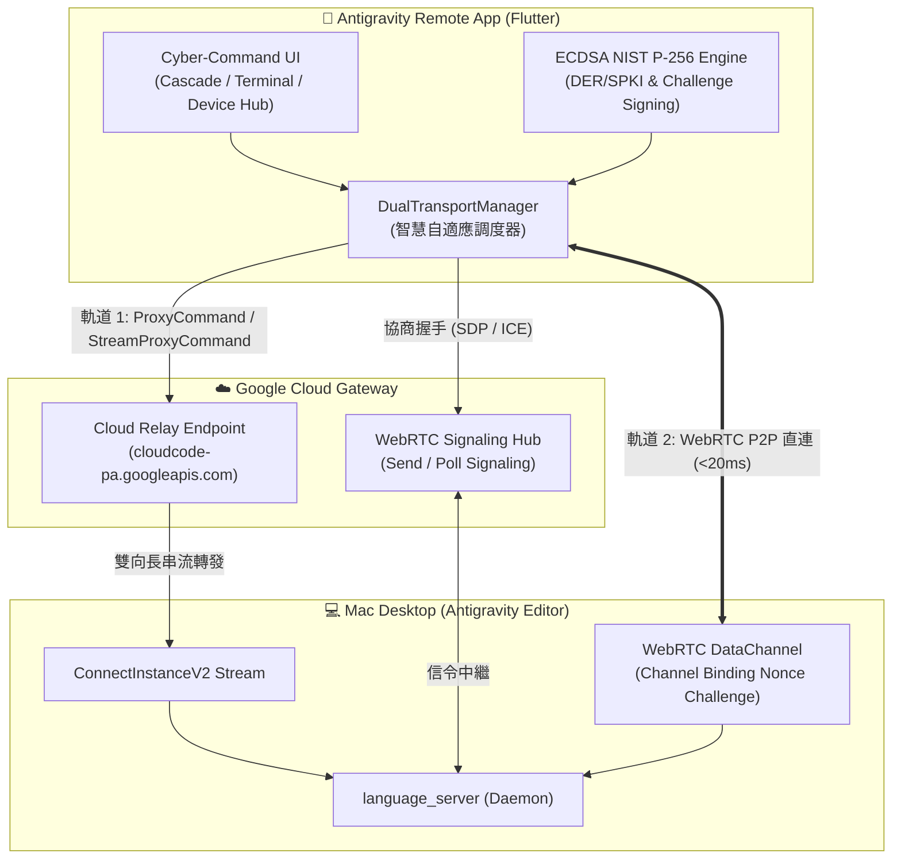

<div align="center">


# Antigravity Remote (遠端控制中樞)

**Next-Gen Cross-Platform Native Remote Deck for Antigravity (Google Jetski) Editor**  
*次世代 Antigravity (Google Jetski) 編輯器跨平台原生遠端控制工作台*

[](https://flutter.dev)
[](https://dart.dev)
[](https://riverpod.dev)
[](https://webrtc.org)
[](https://csrc.nist.gov)
[](LICENSE)

[繁體中文](#-繁體中文說明) • [English](#-english-documentation)

---

</div>

<a name="-繁體中文說明"></a>
## 🇹🇼 繁體中文說明

**Antigravity Remote** 是一款專為 **Antigravity (Google Jetski)** 打造的現代化跨平台原生控制客戶端（支援 iOS、Android 與 macOS）。透過深度逆向工程解析 Antigravity 本機二進位執行檔（`language_server`）、Protobuf 通訊協議（`devtools_jetski_boq_api_proto.ApiService` 與 `LanguageServerService`）、ConnectRPC 及 WebRTC P2P DataChannel，實現隨時隨地遠端調度、監控思考過程與審批本機終端指令。

---

### 🌟 核心架構亮點



#### 1. 雙軌混合自適應傳輸 (Dual-Transport Hybrid Architecture)
- **軌道 1 (Cloud Relay 模式，100% 可靠性保底)**：
  - 客戶端直接向 Google Cloud 閘道器發起 `ProxyCommand` 與 `StreamProxyCommand`。
  - Google Cloud 透過桌面端主動出站維護的 `ConnectInstanceV2` 雙向長串流通道轉發 RPC。
  - **使用者 Mac 桌面端無須公網 IP、無須路由器 Port Forwarding 或 DDNS 設定**。
- **軌道 2 (WebRTC P2P DataChannel Mesh 模式，極致低延遲)**：
  - 客戶端調用 `InitiateMeshSession`，並上報客戶端本地生成的 **NIST P-256 (secp256r1) ECDSA 公鑰**（DER / SPKI 格式）。
  - 雲端下發 STUN (`stun:stun.l.google.com:19302`) 與 TURN 伺服器配置。
  - 透過 `SendSignalingMessage` 與 `PollSignalingMessages` 交換 SDP Offer/Answer 與 ICE Candidates。
  - 連通後桌面端發送 **Channel Binding Nonce 挑戰**，客戶端透過純 Dart ECDSA P-256 私鑰簽章驗證回應。
  - 升級至 P2P 直連通道，端到端延遲降至 **< 20ms**！
- **5 位元組資料分幀標準 (DataChannel Framing)**：
  - `[1 byte Compression Flag: 0x00] [4 bytes Big-Endian Length: uint32] [Payload bytes]`

---

### ✨ 主要功能特色

| 功能模組 | 特色描述 |
| :--- | :--- |
| 📸 **一鍵 QR 掃碼配對** | 整合 `mobile_scanner`，支援解析 Antigravity 官方生成的 Google AccountChooser 格式、`antigravity://` 深度連結、JSON 與直接 UUID 輸入。 |
| 🧠 **Cascade 思考即時串流** | 擬真神經網絡脈衝動畫，即時呈現 Agent 內部思維推理過程 (`ThinkingCard`)，可自由展開/折疊並顯示精準耗時。 |
| 🛠️ **Trajectory 工具執行步驟** | 視覺化呈現 `run_command`、`replace_file_content`、`write_to_file`、`read_file` 等工具調用，內建語法著色之代碼變更對照 (`CodeDiffViewer`)。 |
| 🛡️ **指令安全審批互動** | 當 Agent 進入 `WAITING_USER_INTERACTION` 狀態時，自動彈出審批對話框，針對高危險指令（如 `rm`、`sudo`）提供醒目標籤，支援一鍵 Approve / Reject 及回傳補充反饋。 |
| 💻 **即時遠端終端控制台** | 串流監看本機終端輸出 (`StreamTerminalOutput`)，提供專用虛擬快捷晶片鍵盤（`Ctrl+C`、`Enter`、`Tab`、`clear`）與輸入調度 (`SendTerminalInput`)。 |
| 🧪 **完整離線演示模式 (Demo Mode)** | 內建高保真度模擬器 (`MockAntigravityService`)，在未連接真實 Mac 桌面端時亦能即時體驗完整思考、審批、終端日誌與雙軌切換。 |

---

### 🎨 UI/UX 設計理念 (Cyber-Command Deck)

- **配色體系**：深空石墨曜石黑 (`#080C14` / `#0F172A`) 底色，搭配高對比雷射青 (`#00E5FF`)、翡翠綠 (`#00E676`)、警示琥珀 (`#FFB300`)、霓虹洋紅 (`#FF3366`) 與神經紫羅蘭 (`#A855F7`)。
- **字型排版**：採用 Google Fonts 的 **JetBrains Mono**（代碼、UUID、終端輸出）與 **Plus Jakarta Sans / Outfit**（標題與介面層級）。
- **微互動質感**：雙軌連線狀態指示燈 (`StatusIndicator`)、即時 Ping 延遲計量儀 (`TransportBadge`)、雷射掃描動畫視窗與磨砂玻璃質感卡片。
- **全平台自適應**：
  - 手機端：單手好操作的底部 Cyber 導航列。
  - 平板 / macOS 桌面端：左側 NavigationRail + Split Panel 主從工作流排版。

---

<a name="-english-documentation"></a>
## 🌐 English Documentation

**Antigravity Remote** is an ultra-modern, cross-platform native remote control companion (supporting iOS, Android, and macOS) built specifically for the **Antigravity (Google Jetski)** editor.

Reverse-engineered from the Antigravity local binary daemon (`language_server`), Protobuf schemas (`devtools_jetski_boq_api_proto.ApiService` & `LanguageServerService`), ConnectRPC, and WebRTC P2P DataChannel protocols, it allows developers to remotely supervise, review thought streams, and approve terminal commands on their host Mac from anywhere.

---

### 🚀 Key Architectural Pillars

#### 1. Dual-Transport Hybrid Architecture
- **Track 1: Cloud Relay Mode (100% Reliable Fallback)**
  - Client connects to Google Cloud Gateway (`cloudcode-pa.googleapis.com`) using `ProxyCommand` (Unary) and `StreamProxyCommand` (Server Streaming).
  - Google Cloud dispatches RPCs through an outbound persistent bi-directional streaming pipe (`ConnectInstanceV2`) maintained by the host Mac.
  - **No public IP, port forwarding, or DDNS required on the developer's Mac**.
- **Track 2: WebRTC P2P DataChannel Mesh Mode (<20ms Ultra-Low Latency)**
  - Client calls `InitiateMeshSession` and submits a client-generated **NIST P-256 (secp256r1) ECDSA Public Key** in DER/SPKI format.
  - Cloud provides STUN (`stun:stun.l.google.com:19302`) and TURN configuration.
  - Signaling messages (SDP Offer/Answer & ICE Candidates) are exchanged via `SendSignalingMessage` and `PollSignalingMessages`.
  - Once the DataChannel opens, the host Mac sends a **Channel Binding Nonce Challenge**, which the client signs using pure Dart ECDSA P-256 cryptography.
  - Seamlessly promoted to direct P2P mesh connection with **latency < 20ms**!
- **DataChannel Framing (5-byte header)**:
  - `[1 byte Compression Flag: 0x00] [4 bytes Big-Endian Length: uint32] [Payload bytes]`

#### 2. Feature Matrix
- 📸 **Instant QR Code Pairing**: Supports Google AccountChooser URLs, deep links (`antigravity://`), configuration JSON, and raw instance UUIDs.
- 🧠 **Cascade Reactive Thought Streaming**: Neural pulse animation displaying agent reasoning in real-time (`ThinkingCard`) with precise duration timing.
- 🛠️ **Trajectory Step Cards & Diff Viewer**: Live status of tool executions (`run_command`, `replace_file_content`, etc.) and syntax-highlighted code diffs.
- 🛡️ **Interactive Safety Approvals**: Action sheet prompts when an agent requires authorization (`WAITING_USER_INTERACTION`) with security flags for destructive commands.
- 💻 **Live Remote Terminal**: Continuous terminal output streaming with specialized virtual keys (`Ctrl+C`, `Enter`, `Tab`, `clear`) and input transmission.
- 🧪 **Built-in Offline Demo Mode**: High-fidelity simulator (`MockAntigravityService`) enabling comprehensive hands-on evaluation without an active desktop connection.

---

## 📂 專案目錄結構 (Project Structure)

```text
antigravity_remote/
├── assets/
│   └── images/
│       └── banner.png                      # Cyber-command repository banner
├── docs/
│   └── banner.png                          # Documentation preview image
├── lib/
│   ├── main.dart                           # Application entry point & Riverpod root
│   ├── app.dart                            # Dark Cyber Theme & Adaptive Layout
│   ├── core/
│   │   ├── models/                         # Domain models (Cascade, Instance, Terminal, Trajectory)
│   │   ├── network/
│   │   │   ├── cloud_relay_client.dart     # Cloud Relay (ProxyCommand / StreamProxyCommand)
│   │   │   ├── dual_transport_manager.dart # Adaptive Dual-Transport orchestrator
│   │   │   ├── ecdsa_p256_service.dart     # Pure Dart NIST P-256 keygen, SPKI DER & Signing
│   │   │   ├── endpoints.dart              # Google Cloud RPC route definitions
│   │   │   ├── transport_interface.dart    # Abstract transport contracts & framing
│   │   │   └── webrtc_mesh_client.dart     # WebRTC DataChannel & DTLS challenge handshake
│   │   ├── services/
│   │   │   ├── mock_antigravity_service.dart # Offline demo mock generator
│   │   │   ├── qr_parser_service.dart      # QR Code & URL parameter parser
│   │   │   ├── remote_control_service.dart # Unified stream dispatcher & approval handler
│   │   │   └── storage_service.dart        # SharedPreferences persistence
│   │   └── theme/
│   │       └── app_theme.dart              # CyberColors, typography & UI styling
│   ├── features/
│   │   ├── cascade/                        # Cascade chat view, thinking cards & approval modals
│   │   ├── device/                         # Device hub, QR scanner & connection settings
│   │   └── terminal/                       # Live terminal stream & virtual keystroke console
│   └── shared/                             # Reusable cyber buttons, cards & indicators
└── test/
    ├── core/                               # Unit tests for network, crypto & parsers
    ├── features/                           # Riverpod state notifier unit tests
    └── widget_tests/                       # Widget integration & interaction tests
```

---

## ⚡ 快速開始 (Getting Started)

### 前置要求 (Prerequisites)
- [Flutter SDK](https://flutter.dev) `^3.38.0` (Dart `^3.10.0`)
- Xcode 16+ (適用於 iOS / macOS 構建)
- Android Studio / Android SDK (適用於 Android 構建)

### 安裝與啟動 (Installation & Run)

```bash
# 1. 克隆本儲存庫 (Clone repository)
git clone https://github.com/ImL1s/antigravity-remote.git
cd antigravity-remote

# 2. 獲取相依套件 (Get dependencies)
flutter pub get

# 3. 運行單元與 Widget 測試 (Run tests)
flutter test

# 4. 啟動應用 (Run application)
flutter run
```

---

## 📱 配對操作指南 (Pairing Guide)

1. 在 Mac 桌面端開啟 **Antigravity** 編輯器。
2. 開啟 **Settings** -> 搜尋 **Remote Control**。
3. 開啟 **Enable Remote Control** 切換開關。
4. 點選畫面顯示的 QR Code，或點擊複製連結。
5. 在手機或平板端開啟 **Antigravity Remote**，點選「掃描 QR 配對」或手動貼上連結。
6. 連線成功後，雙軌傳輸指示燈轉為綠色/青色，即可即時接管遠端 Agent 思考與終端控制！

---

## 🧪 測試驗證記錄 (Verification Record)

本專案經過嚴格的單元測試與 Widget 整合測試覆蓋：

```bash
flutter test
```

- ✅ **ECDSA NIST P-256 密鑰與簽名測試**：驗證公私鑰生成、SPKI DER 編碼導出及 Channel Binding Nonce 簽章驗證。
- ✅ **QR Parser 測試**：驗證 Google AccountChooser、`antigravity://` 深度連結、JSON 負載與直接 UUID 解析。
- ✅ **RemoteControlService 測試**：驗證 Live 模式與 Demo 模式切換、即時思考串流、軌跡步驟解析及審批指令派送。
- ✅ **Riverpod Notifier 測試**：覆蓋 `CascadeNotifier`、`TerminalNotifier`、`DeviceNotifier` 的狀態變遷與生命週期。
- ✅ **Widget 測試**：驗證 `TransportBadge` 徽章渲染、`ThinkingCard` 展開折疊、`TrajectoryStepCard` 行內審批按鈕及標籤導航切換。

---

## 📄 開源授權 (License)

This project is licensed under the MIT License - see the [LICENSE](LICENSE) file for details.
